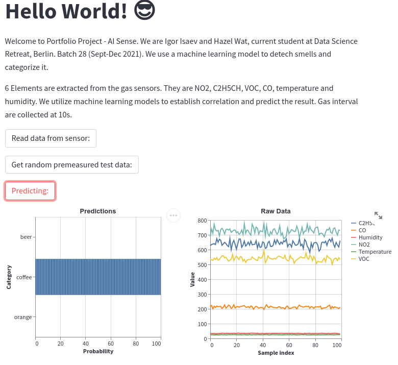
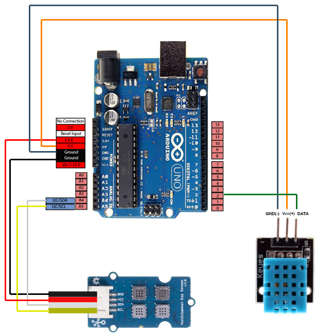
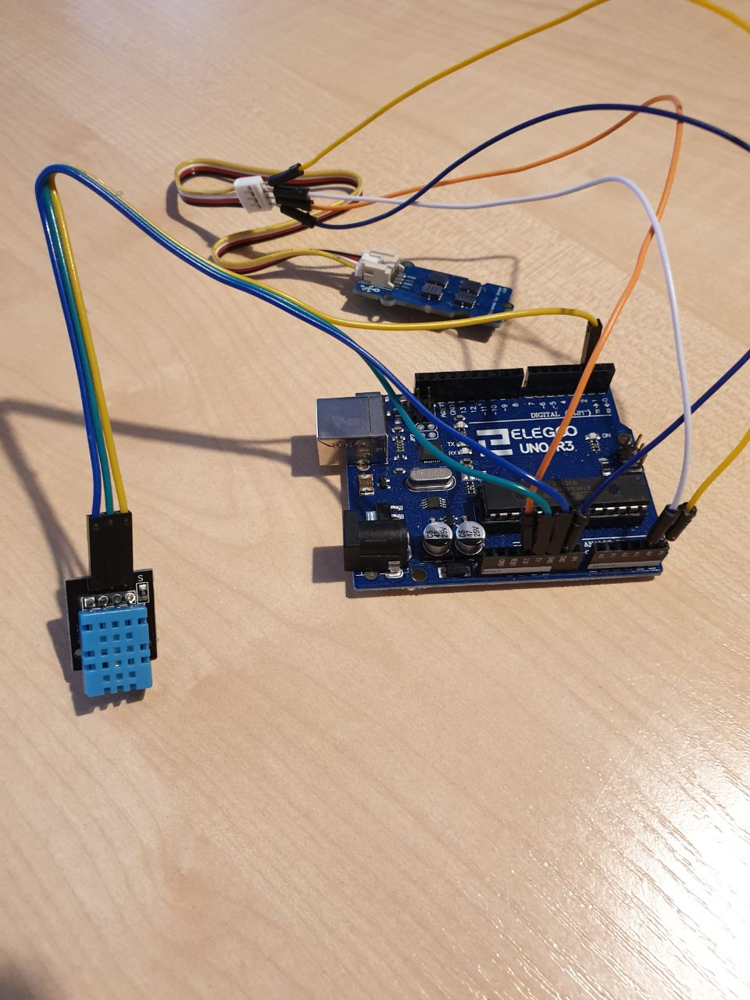
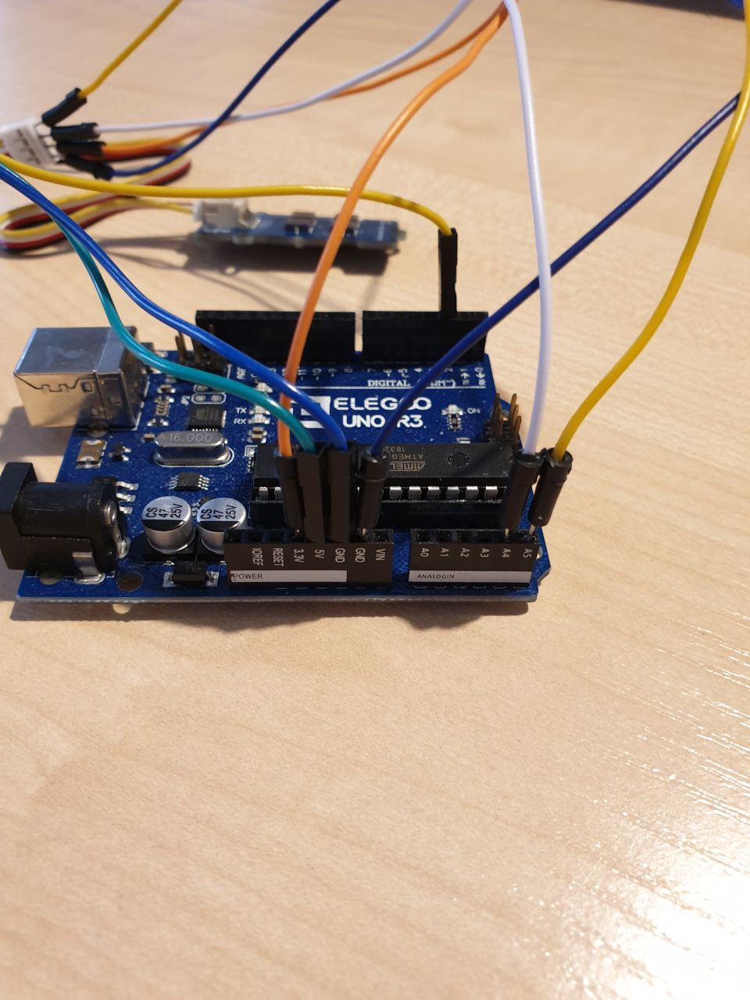

# AI_sense_by_Hazel_n_Igor

The **AI_sense_by_Hazel_n_Igor** repository is a workspace for portfolio project of **Hazel Wat** and **Igor Isaev**. The work on the project was done during the classes of Data Science Retreat in 2021 (Batch 28).

This repository is forked on https://github.com/igivis7/ and https://github.com/hahahazel to reflect the work of all contributors.

The online version of the app is created with Streamlit and can be found here:  
https://share.streamlit.io/igivis7/ai_sense_by_hazel_n_igor_4streamlit_online/main/streamlit_AIsense_by_Hazel_n_Igor.py

---

## Contents
- [About the project](#about-the-project)
- [Live demo](#live-demo)
- [How to make it running](#how-to-make-it-running)
- [Assembling and Connecting to computer](#assembling-and-connecting-to-computer)
- [Features of the project](#features-of-the-project)
<!-- - [future plans and possible upgrade] -->

---

## About the project

This project was dedicated to apply our newly gained knowledge of data science on a real-world task. 

As the object of study, we decided to take 

[Grove multichannel Gas Sensor V2](https://wiki.seeedstudio.com/Grove-Multichannel-Gas-Sensor-V2/) (GGSv2) sensor and implement Machine Learning to solve an odor recognition task.

During the project we have practiced building of Data Science (DS) project from scratch, mastered our Machine Learning (ML) skills and learned ways to overcome problems. 

The GGSv2 sensor consists of 4 measurement heads for measuring Nitrogen dioxide (NO2), Carbon monoxide (CO), Ethyl alcohol (C2H5OH) and Volatile organic compounds (VOCs). 
Each head is an [metal oxide semiconductor gas detector](https://www.ncbi.nlm.nih.gov/pmc/articles/PMC7700484/) made to measure a certain gas molecule.
The combination of the 4 readings allows to detect and distinguish different odors.
The GGSv2 sensor can be used together with Arduino boards, [WIO terminal](https://www.seeedstudio.com/Wio-Terminal-p-4509.html), Raspberry Pi or any other device that is able to work with I2C communication protocol.

To make classification of odors a fully connected neural network was implemented.

The live demo (with pre-collected samples), code description, project features, hardware list and possible upgrades are listed below.

---

## Live demo

There are two options to see run live demo:
1. Online version via [Streamlit](https://share.streamlit.io/igivis7/ai_sense_by_hazel_n_igor_4streamlit_online/main/streamlit_AIsense_by_Hazel_n_Igor.py) app. There is possible to see GUI and run with pre-trained model and simulated samples. It does not work with hardware (GGSv2).
    1. go to [the app page](https://share.streamlit.io/igivis7/ai_sense_by_hazel_n_igor_4streamlit_online/main/streamlit_AIsense_by_Hazel_n_Igor.py) 
    2. press `Get random premeasured test data` button.
    3. press `Predicting` button to run prediction using existing model. 
2. Local Streamlit app demo.
    1. make sure you have installed all required packages in your environment (see the next section)
    2. go to the folder 
    `cd ./soft/streamlit_app/`
    3. run `streamlit run streamlit_app.py`

---

## How to make it running.

Here is an instruction to make your copy of the project running.  
The procedure is described for a Linux-based OS. It was also was checked with MacOS, but not with Windows.  

There a few steps to create a device that is able to detect and distinguish odors: 

0. **Get** an Arduino, Gas Sensor, HDT Sensor, and supplementary parts to combine it.
1. **Assemble** the device according to the instructions in the section [Assembling and Connecting to computer](#assembling-and-connecting-to-computer). And connect to a computer.
2. **Install Arduino** IDE.
3. **Upload firmaware** to arduino:
    - open file [__!__ files] in Arduino IDE
    - select board
    - select port
    - check
    - upload
4. **Create Conda environment** and install requirements:
    - `conda create -n pyAIsense python=3.9.7`
    - `conda activate pyAIsense`
    - `pip install ipykernel`
    - `python -m ipykernel install --user --name pyAIsense --display-name "pyAIsense_env"`
    - `pip install -r ./info_n_docs/requirements_AIsense.txt`
    - `jupyter-notebook`
5. **Collect data** with `01_Collect_Data.ipynb`  
from *./soft/main_soft/*   
Settings:
    - in cell `Settings to Change`
        - `dir_2_save` directory to save collected data, located in *./data/readback*
        - `label` name of a sample
        - `add_label` additional label, not taken into further analysis, but cann't be empty
        - `env_condition` name of condition for measurement like *cold*, *humid* or *warm*
        -  `reading_duration` time of sample collection in [min] (0.2min=12sec)
    - in cell `Additional Settings`
        - `serial_port` the port of Arduino connection. In Linux default is */dev/ttyACM0*, but might differ. Use Arduino IDE to find the correct port.
6. **Check** the collected data with `02_Check_Data.ipynb`  
from *./soft/main_soft/*  
Settings:
    - cell `Change to the directory with data`
        - `dir_data` change to the directory with collected data.
7. **Convert** multiple files into a single one with `03_Data_to_Single_File.ipynb`  
from *./soft/main_soft/*  
Settings:
    - cell `Change to the directory with data`
        - `dir_data` change to the directory with collected data.  
To remember:
    - cell `Save to a new file`
        - output of the cell, parameter `filename_to_save`
8. **Train** a model with `04_TFmodel_Train.ipynb`  
from *./soft/main_soft/*  
Settings:
    - cell `Settings and Paths`
        - `filename2load` this should be the file from `03_Data_to_Single_File.ipynb` cell `Save to a new file`
        - `model_filename` give here the model name
To remember:
    - cell `Lets see the classes`
        - output of the cell, parameter `classes_values`
9. **Make live prediction** with `05_TFmodel_Predict.ipynb `  
from *./soft/main_soft/*  
Settings:
    - cell `Define the classes to be measured`
        - `classes_values` should be list from `04_TFmodel_Train.ipynb` cell `Lets see the classes` output
    - cell `set the paths and load data`
        - `model_filename` the name of the model from `04_TFmodel_Train.ipynb` cell `Settings and Paths`
10. Make **Streamlit app** running
    - change in file `./soft/streamlit_app/streamlit_app.py`
        - line 29 : `model_ff` set models name from `04_TFmodel_Train.ipynb` cell `Settings and Paths`
        - line 33: `classes_values` should be list from `04_TFmodel_Train.ipynb` cell `Lets see the classes` output
        - line 63: `serial_port` set correct port of Arduino, can be found via Arduino IDE
    - run the streamlit:
        - `cd ./soft/streamlit_app/`
        - `streamlit run streamlit_app.py`

---

## Assembling and Connecting to computer

**Parts:** Arduino Uno, Grove multichannel Gas Sensor V2 (GGSv2), DHT11

**Connections table:**
| Device Name | Device Pin | Arduino Pin   |
|-------------|------------|---------------|
| GGSv2       | GND        | GND           |
|             | VCC        | 3.3V          |
|             | SDA        | A4            |
|             | SCL        | A5            |
| DHT11       | GND        | GND           |
|             | VCC        | 5V            |
|             | Serial Data| Digital Pin 2 |

**List of steps:**

1.  Connect parts according to the table.
2.  Connect to computer via USB.
3.  Open Arduino IDE (install it if it is not yet done).
4.  Open project "GGSv2_n_DHT11_03_10hz.ino".
5.  Select Arduino Uno as current board. IDE: Tools -> Board -> 'Arduino Uno'
6.  Check/select the port to which the board is connected. IDE: Tools -> Port -> '/dev/ttyACM0'
7.  IDE: Sketch -> Verify/Compile
8.  IDE: Sketch -> Upload
9.  If appears an error "Error opening serial port '/dev/ttyACM0'"  
    then in terminal: `sudo chmod 666 /dev/ttyACM0`.
10. See the output: IDE: Tools -> Serial Monitor  
    
The data format should be like: `12:40:15.641 -> 258,61,148,86,25,29`:
- `12:40:15.641` is a record time
- 6 numbers are: NO2 (GM102B), C2H5OH (GM302B), VOC (GM502B), CO (GM702B), temperature [degC], humidity [%]

**Schematics of the connections:**

<table>
  <tr>
     </td>
  </tr>
  <tr>
    <td>  </td>
    <td>  </td>
    <td>  </td>
  </tr>
</table>

---

## Features of the project

See in the separate page:
[Features and Challenges of work with GGSv2](./info_n_docs/challenges_n_features_of_GGSv2.md)

<!--
#>>>>>>>>>>>>>>>>>>>>>>>>>>>>>>>>>>>>>>>>>>>>>>>>>>>>>>>>>>>>>>>>>>>>>>>>>>>>>>
#>>>>>>>>>>>>>>>>>>>>>>>>>>>>>>>>>>>>>>>>>>>>>>>>>>>>>>>>>>>>>>>>>>>>>>>>>>>>>>
#>>>>>>>>>>>>>>>>>>>>>>>>>>>>>>>>>>>>>>>>>>>>>>>>>>>>>>>>>>>>>>>>>>>>>>>>>>>>>>
#>>>>>>>>>>>>>>>>>>>>>>>>>>>>>>>>>>>>>>>>>>>>>>>>>>>>>>>>>>>>>>>>>>>>>>>>>>>>>>
#>>>>>>>>>>>>>>>>>>>>>>>>>>>>>>>>>>>>>>>>>>>>>>>>>>>>>>>>>>>>>>>>>>>>>>>>>>>>>>
-->

<!--
- initially we used edge impulse to collect and train
- but later we faced problems with the project and wanted to try diverse options of the the data manipulation to fix it
- this project shows out attempt of odor detector realization with help of Arduino.
-->