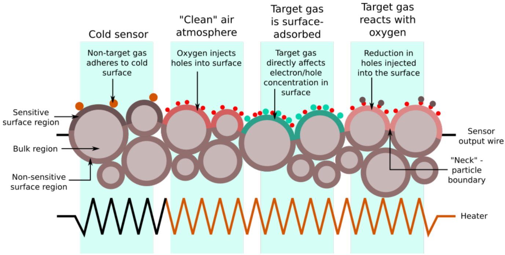
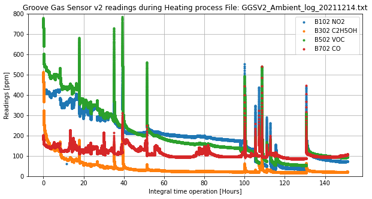

# Challenges a features of work with GGSv2

The biggest adventure during the project was hardware.

During the project we have learned a lot about DS, but even more about hardware and particularly about GGSv2 sensor.

All features of the sensor come from its constitution and principles on which it is built.

The sensor combines 4 gas detector heads that utilize MOS/MOF principle. It is well explained in the article [Practical Use of Metal Oxide Semiconductor Gas Sensors for Measuring Nitrogen Dioxide and Ozone in Urban Environments](https://www.mdpi.com/1424-8220/17/7/1653/htm).

First of all, due to complicated (on micro-scale) body structure (bulk body and oxide film), it is **not possible to produce 2 identical sensors** (also applicable to other devices but here is most visible).

That means a slight difference in body structure will give a relatively big/visible difference in readings. That is why all sensors particularly must be calibrated.

Second, **the readings strongly depend on the surrounding conditions**, mainly temperature, contamination status, and humidity.

The manual for the sensor say that after unpacking or after long inactivity **the sensor must be preheated up to 72hours**. Additionally, after the unpacking procedure, a sensor must be **preheated 24 hours before each use** (after a break).

Additionally, **the room temperature has a strong influence on the readings**. The lower the temperature, the lower the reading value. That is why we have added **DHT11** sensor to the project and have done measurements for 3 environmental conditions.

Also, there is **cross-talk between heads**. It means a head measures concentration of not only specified gas, but also other gases. [See here.](https://www.mdpi.com/1424-8220/17/7/1653/htm)

One more challenge that to be mentioned is the fact that the **sensor warm-up procedure must be well established** so that the sensor would provide the same readings for the same sample. This comes from the beforementioned features. At some moment, we have noticed that the readings of the sensor is completely different compared to the values of sample measurements, which were collected for the training procedure. The environmental conditions (temperature and humidity) were completely the same. **The problem of unreproducible measurements** is still unclear to us.  
We suppose that this might have happened due to the fact that before training data collection, the sensor was continuously working for more than a week. Afterward, the sensor was off for 2 days, and before the test measurements, it was pre-warmed for only 24 hours (which stays in instructions and should be enough). *We suppose that after 24 hours of warm-up, the readings stabilize but not completely*.
Also, we suppose that during the break, the **sensor might be contaminated** with some dust, which resulted in the difference in readings.  

